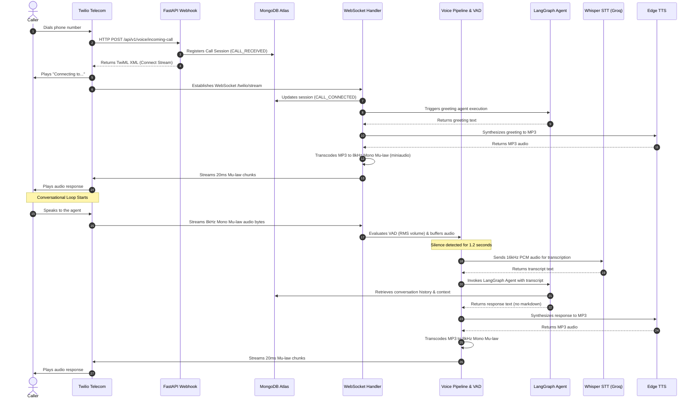

# AI Shivam - Real-time Voice and Chat Digital Twin Platform

AI Shivam is a real-time digital twin platform designed to act as an automated conversational agent representing Shivam. The system features a modern Next.js 15 web client offering chat and voice modules, a high-performance FastAPI backend, a stateful LangGraph conversation agent with RAG and tools, and a real-time voice-call telephony pipeline integrating Twilio Media Streams, Whisper Speech-to-Text, and Edge Text-to-Speech.

---

## Architecture and System Workflows

The platform is divided into two primary systems:
1. **Web Interface (Next.js & FastAPI WebSocket)**: Handles web-based text chat and audio streaming.
2. **Telephony Integration (Twilio Voice & WebSockets)**: Connects telephone calls to the AI agent.

### Telephony System Flow

When a recruiter dials the Twilio phone number, the system executes the following steps:

1. **Incoming Call Hook**: Twilio sends an HTTP POST request to the FastAPI incoming webhook.
2. **Session Registration**: The webhook registers the call session details in MongoDB Atlas.
3. **TwiML Streaming Command**: The webhook returns a TwiML response instructing Twilio to open a bidirectional WebSocket audio stream.
4. **WebSocket Connection**: Twilio establishes a WebSocket connection to the stream endpoint.
5. **Greeting Synthesis**: The pipeline generates a greeting response text via the LangGraph agent, synthesizes it using Microsoft Edge-TTS, transcodes it to 8kHz Mu-law PCM, and streams it back.
6. **Conversational Loop**: 
   - The user speaks, and Twilio streams the 8kHz Mu-law audio to the server.
   - Voice Activity Detection (VAD) monitors user speech.
   - When the user finishes speaking, the audio is transcoded to 16kHz linear PCM.
   - The audio is sent to the Whisper STT API (via Groq) to get the transcript text.
   - The transcript is processed by the LangGraph agent, which runs RAG and memory retrieval.
   - The generated response text is synthesized to MP3 via Edge-TTS and transcoded back to 8kHz Mu-law.
   - The audio is streamed back in 20ms chunks.
   - If the user speaks while the AI is responding, the VAD detects the barge-in, immediately cancels the current streaming tasks, sends a `clear` command to Twilio to flush the audio buffer, and prepares for the new user input.



---

## Technology Stack

The platform is constructed using modern, high-performance technologies selected for specific structural roles:

| Technology | Role | Rationale |
|:---|:---|:---|
| **FastAPI** | Backend Web Framework | Selected for its asynchronous capabilities, low-latency execution, native WebSocket routing, and automatic OpenAPI schema generation. |
| **Next.js 15 (React 19)** | Frontend Framework | Enables server-side rendering, standard route structures (App Router), optimized bundling, and rich UI state management. |
| **Tailwind CSS v4** | UI Styling | Used to build a responsive, modern interface with consistent spacing, high performance, and flexible styling tokens. |
| **LangGraph** | Agent Orchestration | Coordinates the conversational state machine, RAG integration, history, and scheduling tools using cyclic graph workflows. |
| **MongoDB Atlas & Beanie ODM** | Database & Document Mapper | Serves as the persistence layer for profiles, conversation histories, slot bookings, and call sessions. Beanie ODM provides async, type-safe model operations. |
| **Qdrant Vector DB** | Knowledge Retrieval | Houses high-dimensional vector embeddings of CVs, skills, and projects, enabling accurate RAG matching for user queries. |
| **BAAI/bge-small-en-v1.5** | Text Embeddings | Generated locally using SentenceTransformers to produce 384-dimensional dense vectors. Selected for its state-of-the-art retrieval accuracy, extremely low latency, and zero runtime API cost. |
| **Groq API** | Inference and Transcription | Powers ultra-low latency text generation via Llama 3 models and rapid speech-to-text transcription via Whisper Large v3. |
| **Microsoft Edge TTS** | Speech Synthesis | Delivers high-quality neural speech synthesis with natural Indian English accentuation (`en-IN-PrabhatNeural`) without subscription billing limits. |
| **Miniaudio** | Audio Decoding | Implements fast, lightweight, pure-python decoding of MP3 buffers into raw PCM arrays without requiring external binary dependencies like FFmpeg. |
| **Audioop-LTS** | Audio Transcoding | Provides robust, C-compiled, overflow-safe G.711 μ-law encoding and decoding for Python 3.13 on Windows. |

---

## Environment Configuration

Configure the `.env` file in the project root with the following variables:

```bash
# Core Settings
APP_NAME="AI Shivam"
APP_ENV=development
DEBUG=true
PORT=8000
HOST=0.0.0.0
API_V1_PREFIX=/api/v1
LOG_LEVEL=INFO

# Security
JWT_SECRET_KEY="ai_shivam_development_secret_key_change_me_in_production"

# MongoDB Atlas Database URL
MONGO_URI="mongodb+srv://<username>:<password>@<cluster>.mongodb.net/"
MONGO_DB_NAME="ai_twin_db"

# Vector Store
QDRANT_URL="https://<cluster-endpoint>.cloud.qdrant.io"
QDRANT_API_KEY="your-qdrant-api-key"
QDRANT_COLLECTION_NAME="shivam_knowledge_base"

# External Integrations
GROQ_API_KEY="gsk_your_groq_api_key"
GOOGLE_API_KEY="your_google_api_key"
MISTRALAI_API_KEY="your_mistral_api_key"

# Cloudinary Integration
CLOUDINARY_CLOUD_NAME="your_cloudinary_cloud_name"
CLOUDINARY_API_KEY="your_cloudinary_api_key"
CLOUDINARY_API_SECRET="your_cloudinary_api_secret"

# GitHub Integration
GITHUB_TOKEN="your_github_personal_access_token"

# Twilio Configuration
TWILIO_ACCOUNT_SID="your_twilio_account_sid"
TWILIO_AUTH_TOKEN="your_twilio_auth_token"
PUBLIC_URL="https://your-ngrok-subdomain.ngrok-free.app"
```

---

## Local Installation and Startup

### Prerequisites
* Python 3.13
* Node.js 18+ and npm
* Ngrok (for exposing the local server to Twilio)

### 1. Backend Setup
Activate your virtual environment and install the required dependencies:
```powershell
# Create and activate virtual environment
python -m venv venv
.\venv\Scripts\Activate.ps1

# Install core requirements
pip install -r requirements.txt

# Install the Python 3.13 audioop compatibility package
pip install audioop-lts
```

Configure your `.env` file using `.env.example` as a template, adding your credentials and database URIs.

Start the FastAPI application:
```powershell
$env:PYTHONPATH="."
python -m uvicorn main:app --reload
```
The server will start on `http://localhost:8000`.

### 2. Frontend Setup
Open a new terminal, navigate to the frontend directory, install npm packages, and start the development server:
```powershell
cd frontend
npm install
npm run dev
```
The client dashboard and chat UI will be accessible on `http://localhost:3000`.

### 3. Exposing the Local Server (Ngrok)
Twilio requires a public HTTPS URL to deliver webhook events. Expose your local FastAPI port (8000) using ngrok:
```powershell
ngrok http 8000
```
Copy the forwarding HTTPS URL generated by ngrok (e.g., `https://xxxx-xxxx.ngrok-free.app`) and set it as the `PUBLIC_URL` in your `.env` file.

### 4. Syncing Twilio Webhooks
To automatically configure the voice webhook settings on your Twilio phone number, execute the helper script:
```powershell
$env:PYTHONPATH="."
python scripts/update_twilio_webhook.py
```
This script will detect all numbers on your Twilio account and configure them to route voice calls to your active ngrok tunnel.

---

## Production Deployment Guide

Before deploying to production, review the following checklist and choose either a VPS Docker Compose deployment or a managed PaaS cloud deployment.

### Production Security Checklist
* **Environment**: Set `APP_ENV=production` and `DEBUG=false` in your `.env` file.
* **Secrets**: Generate a cryptographically secure key for `JWT_SECRET_KEY` (e.g., `openssl rand -hex 32`).
* **Databases**: Use managed, production-grade databases:
  * MongoDB Atlas for document storage.
  * Qdrant Cloud for production vector search.
  * Upstash Redis or Redis Enterprise for caching.
* **HTTPS/SSL**: Twilio requires secure HTTPS webhooks and WSS WebSocket URLs. Ensure SSL certificates are active on your production domains.
* **Tuning**: Adjust `TWILIO_VOICE_LIMIT_SECONDS` to limit call durations and prevent excessive API usage.

---

### Option A: VPS Deployment with Docker Compose and Nginx

This method is suitable for a single virtual machine (e.g. AWS EC2, DigitalOcean Droplet, Linode) running Docker.

#### 1. Setup Docker Environment
Ensure Docker and Docker Compose are installed on the target server. Clone the repository and create your production `.env` file in the root directory.

#### 2. Run Containers
Build and run the backend and database services in detached mode:
```bash
docker compose -f docker-compose.yml up -d --build
```
This spawns the FastAPI application (port 8000), MongoDB (port 27017), Qdrant (port 6333), and Redis (port 6379).

#### 3. Configure Nginx Reverse Proxy
Install Nginx and set up a server block to reverse-proxy traffic to the FastAPI server and Next.js server. Crucially, Nginx must be configured to pass the WebSocket headers necessary for Twilio Media Streams (`/twilio/stream`) and Web Voice (`/voice/stream`).

Create or edit your Nginx site configuration (e.g., `/etc/nginx/sites-available/ai-shivam`):
```nginx
server {
    listen 80;
    server_name api.yourdomain.com;

    location / {
        proxy_pass http://127.0.0.1:8000;
        proxy_http_version 1.1;
        proxy_set_header Upgrade $http_upgrade;
        proxy_set_header Connection "upgrade";
        proxy_set_header Host $host;
        proxy_set_header X-Real-IP $remote_addr;
        proxy_set_header X-Forwarded-For $proxy_add_x_forwarded_for;
        proxy_set_header X-Forwarded-Proto $scheme;
    }
}

server {
    listen 80;
    server_name yourdomain.com;

    location / {
        proxy_pass http://127.0.0.1:3000;
        proxy_http_version 1.1;
        proxy_set_header Upgrade $http_upgrade;
        proxy_set_header Connection "upgrade";
        proxy_set_header Host $host;
        proxy_set_header X-Real-IP $remote_addr;
        proxy_set_header X-Forwarded-For $proxy_add_x_forwarded_for;
        proxy_set_header X-Forwarded-Proto $scheme;
    }
}
```

Enable the configuration and reload Nginx:
```bash
sudo ln -s /etc/nginx/sites-available/ai-shivam /etc/nginx/sites-enabled/
sudo nginx -t
sudo systemctl reload nginx
```

#### 4. Obtain SSL Certificate with Certbot
Install Certbot and get SSL certificates from Let's Encrypt:
```bash
sudo apt install certbot python3-certbot-nginx
sudo certbot --nginx -d yourdomain.com -d api.yourdomain.com
```
Certbot will automatically update the Nginx configuration to enforce HTTPS and handle SSL termination.

---

### Option B: Managed Cloud PaaS Deployment (Zero-Cost Production Setup)

You can deploy the entire application completely free of charge by leveraging the free tiers of Vercel, Render/Koyeb, MongoDB Atlas, Qdrant Cloud, and Upstash.

#### Zero-Cost Architecture Overview
1. **Next.js Frontend**: Hosted on the **Vercel Hobby Plan** (free forever, optimized for Next.js).
2. **FastAPI Backend**: Hosted on **Render Free Web Service** or **Koyeb Free Tier** (both support Docker builds and WebSockets).
3. **Database**: Hosted on **MongoDB Atlas Shared Tier (M0)** (512 MB, free forever).
4. **Vector Database**: Hosted on **Qdrant Cloud Free Tier** (1 GB RAM, 4 GB storage, 1 free cluster).
5. **Cache/Broker**: Hosted on **Upstash Serverless Redis** (1 free database, 10,000 requests/day).

---

#### Step 1: Deploy the FastAPI Backend

##### Option B.1.a: Deploying on Render (Free Tier)
1. Sign up for a free account at [Render](https://render.com).
2. Click **New** > **Web Service**.
3. Connect your GitHub repository containing this codebase.
4. Set the following build settings:
   * **Runtime**: `Docker`
   * **Dockerfile Path**: `Dockerfile` (Render will automatically detect the root Dockerfile and build it).
   * **Instance Type**: `Free` ($0/month, 512 MB RAM, 0.1 CPU).
5. Go to the **Environment** tab and add all the environment variables from your `.env` file (e.g. `MONGO_URI`, `QDRANT_URL`, `GROQ_API_KEY`, `TWILIO_ACCOUNT_SID`, etc.).
   * *Note*: Set `PORT` to `8000`.
6. Add the following production-specific variables to the environment list:
   * **APP_ENV**: `production`
   * **PUBLIC_URL**: Your public backend URL (e.g., `https://ai-shivam-backend.onrender.com`). This is required for Twilio and the keep-alive task.
   * **FRONTEND_URL**: Your deployed frontend URL (e.g., `https://ai-shivam-frontend.vercel.app`). This allows the backend CORS middleware to whitelist the frontend domain for requests.
7. Click **Deploy Web Service**. Render will build the Docker container and expose a public HTTPS URL (e.g., `https://ai-shivam-backend.onrender.com`).

##### Option B.1.b: Deploying on Koyeb (Free Tier Alternative)
Koyeb provides a free tier that supports Docker and WebSockets, and it does not have the same spin-down sleep behavior as Render:
1. Sign up for a free account at [Koyeb](https://www.koyeb.com).
2. Create a new service, connect your GitHub repository, and choose **Docker** as the deployment builder.
3. Configure the environment variables in their dashboard (including `APP_ENV=production`, `PUBLIC_URL`, and `FRONTEND_URL`), set the port to `8000`, and deploy. Koyeb will generate an HTTPS URL (e.g., `https://ai-shivam-backend.koyeb.app`).

---

#### Step 2: Deploy the Next.js Frontend on Vercel

1. Sign up for a free account at [Vercel](https://vercel.com) using your GitHub account.
2. Click **Add New** > **Project** and import your GitHub repository.
3. In the configuration settings:
   * **Framework Preset**: Select **Next.js**.
   * **Root Directory**: Select `frontend` (crucial, since the Next.js app is located in the `frontend` subfolder).
4. Click **Environment Variables** and add:
   * **Key**: `NEXT_PUBLIC_API_URL`
   * **Value**: Your deployed backend URL + API prefix (e.g., `https://ai-shivam-backend.onrender.com/api/v1`).
5. Click **Deploy**. Vercel will build your Next.js application and deploy it on a fast global CDN with a free HTTPS domain (e.g., `https://ai-shivam-frontend.vercel.app`).

---

#### Connecting Frontend and Backend URLs

To connect the frontend and backend deployments, configure the cross-origin connection via the environment variables:
1. **Frontend to Backend**: The frontend application relies on the `NEXT_PUBLIC_API_URL` variable to route all API calls. Ensure it includes the `/api/v1` suffix (e.g., `https://your-backend.onrender.com/api/v1`).
2. **Backend to Frontend (CORS)**: The backend uses the `FRONTEND_URL` environment variable to permit cross-origin requests. FastAPI dynamically whitelists both the HTTP and HTTPS variations of this domain. Without this, the frontend will experience CORS blockages when making requests to the backend.

---

#### Browser Cookie Storage and Cross-Site Behavior

To secure session state management, the authentication service sets secure, HttpOnly cookies in the user's browser.
1. **SameSite and Secure Attributes**: When `APP_ENV` is set to `production`, the cookies (`access_token` and `refresh_token`) are automatically configured with `Secure=True` and `SameSite=None`. This is mandatory for cross-site requests, allowing the frontend (`vercel.app`) to send cookies to the backend (`onrender.com`).
2. **Browser Restrictions**: Many modern browsers (such as Safari with Intelligent Tracking Prevention, or Chrome with third-party cookie restrictions) block cross-site (`SameSite=None`) cookies by default to protect user privacy.
3. **Subdomain Solution**: If users experience session persistence issues due to third-party cookie blocking, configure a custom domain. By pointing the frontend to `app.yourdomain.com` and the backend to `api.yourdomain.com`, they share the same registrable domain (`yourdomain.com`). This makes the cookies "first-party" (allowing `SameSite=Lax` or `SameSite=None` to function seamlessly without browser blockages).

---

#### Keeping the Render Free Tier Active (Never Sleep Mode)

Render Free Tier instances automatically spin down (go to sleep) after 15 minutes of inactivity. When the backend is sleeping, the next incoming request (e.g., a phone call or a user visiting the page) experiences a cold-start delay of 30-50 seconds, which will cause Twilio webhooks to time out. 

To prevent this, the application implements a dual keep-alive workaround:
1. **Internal Keep-Alive Loop**: FastAPI starts a background task (`keep_alive_task`) on startup when `APP_ENV=production` and `PUBLIC_URL` is set. Every 10 minutes, the task makes an HTTP GET request to its own public URL (e.g., `https://your-backend-domain.onrender.com/health`). This request is routed through Render's external load balancer, registering as active internet traffic and resetting Render's 15-minute inactivity timer.
2. **External Ping Monitor (UptimeRobot)**: Since the internal loop cannot run if the container is already asleep (e.g., after a new deployment or an unexpected server restart), register a free account on [UptimeRobot](https://uptimerobot.com) or [Cron-job.org](https://cron-job.org) and set up an HTTPS ping monitor targeting `https://your-backend-domain.onrender.com/health` to execute every 5 minutes. This ensures the container is immediately woken up if it goes to sleep, and stays active permanently.

---

#### Step 3: Register Webhook in Twilio

Now that your backend is deployed permanently in the cloud:
1. Copy your public backend domain (e.g., `https://ai-shivam-backend.onrender.com`).
2. Run the configuration script locally, specifying your deployed URL in your `.env` file:
   * In your local `.env`, update `PUBLIC_URL` to match your deployed backend URL:
     ```env
     PUBLIC_URL="https://ai-shivam-backend.onrender.com"
     ```
   * Run the sync script:
     ```bash
     $env:PYTHONPATH="."
     python scripts/update_twilio_webhook.py
     ```
   * This instantly updates the incoming voice webhook on your Twilio account to point to your new cloud deployment, making the system 100% independent of your local PC.

---

#### Telephony Call Flow and Connection Verification

When a recruiter or user places a telephone call to your Twilio phone number, the system executes the following real-time communication pipeline:

1. **Incoming Webhook**: The call lands on Twilio's telecom servers, which make an HTTP POST request to the backend's `/api/v1/voice/incoming-call` endpoint.
2. **Session Persistence**: The backend creates a new call record in MongoDB Atlas, tracking call status, metadata, and timestamps.
3. **TwiML Streaming Directive**: The backend returns a TwiML XML response containing a `<Connect><Stream url="wss://your-backend-domain.onrender.com/api/v1/voice/twilio/stream" /></Connect>` block. This instructs Twilio to immediately establish a bidirectional WebSocket connection.
4. **WebSocket Connection**: Twilio connects to the WebSocket stream. The backend starts the voice session, triggers the LangGraph agent to generate a personalized greeting text, and synthesizes it to MP3 using Microsoft Edge-TTS.
5. **Real-time Audio Streaming**:
   * The backend transcodes the MP3 audio into 8kHz Mono Mu-law PCM format (the telephony standard) and sends it in 20ms chunk payloads to Twilio.
   * Twilio converts these payloads to voice signals and plays them to the caller.
   * When the user speaks, Twilio streams their voice audio bytes back to the backend.
   * The backend's Voice Activity Detection (VAD) evaluates the audio signal. Once silence is detected, the audio is transcoded to 16kHz Mono PCM, and sent to Whisper STT via Groq.
   * The resulting transcript is processed by the LangGraph RAG agent, and the cycle continues.

---

### Syncing Webhook in Production
Once your backend is deployed and accessible via HTTPS (e.g. `https://api.yourdomain.com`):

1. Set `PUBLIC_URL="https://api.yourdomain.com"` in your production environment variables.
2. Run the update script on your production server or locally (by loading production environment credentials) to update your Twilio phone number:
   ```bash
   python scripts/update_twilio_webhook.py
   ```

---

## Verifying Deployed Functionalities

Once the deployment is complete, verify each system module to ensure perfect operation:

### 1. Ingestion and Retrieval Verification
1. Access the Next.js Admin Dashboard at `https://yourdomain.com/admin/dashboard`.
2. Seed the availability calendar and upload a new resume PDF.
3. Check the ingestion status logs to ensure PDF parsing, chunking, embedding generation (`BAAI/bge-small-en-v1.5`), and upload to Qdrant complete without error.

### 2. Website Chat Verification
1. Visit `https://yourdomain.com/chat`.
2. Send a query like "What projects has Shivam worked on?".
3. Ensure the message returns relevant answers fetched from Qdrant RAG, along with document citations and confidence tags.

### 3. Website Voice Agent Verification
1. Visit `https://yourdomain.com/voice` and click **Start**.
2. Give microphone permissions and speak.
3. Observe the client-side VAD state transitions: `LISTENING` -> `THINKING` (after 3 seconds of silence) -> `SPEAKING`.
4. Ensure audio playback functions cleanly and the avatar's glowing indicator animates in sync with the agent's speech.

### 4. Twilio Phone Call Verification
1. Dial the Twilio phone number `+18062305103`.
2. Verify that the call connects immediately, plays the synthesized welcome message, and reacts to your voice.
3. Test barge-in capability: interrupt the agent mid-sentence. Verify that it stops speaking instantly and captures your new instruction.
4. Try booking an interview slot. Verify in MongoDB Atlas or the Admin Dashboard that the booked slot is marked as taken under the recruiter's name and email.
